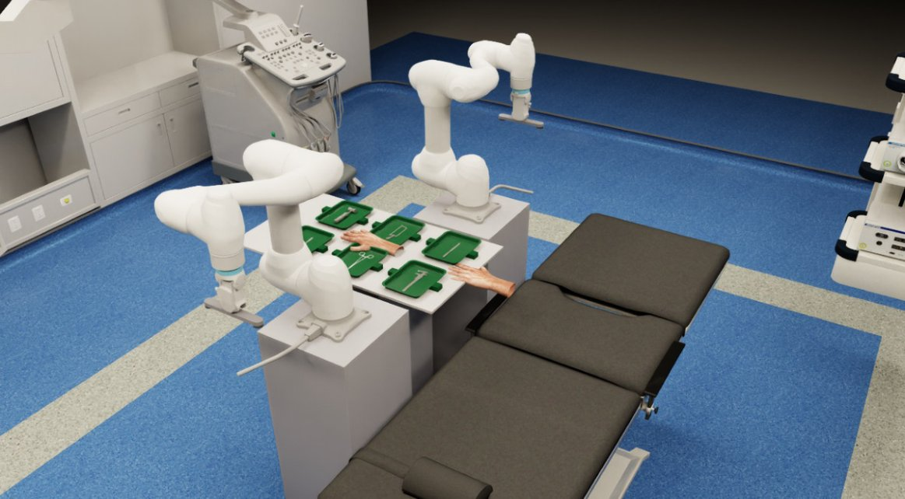
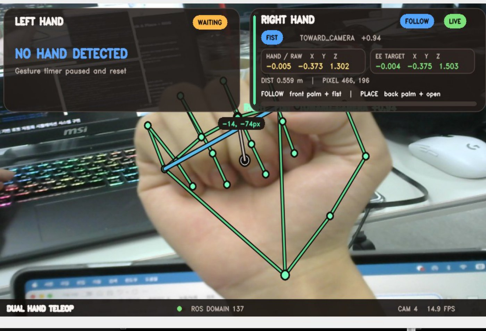
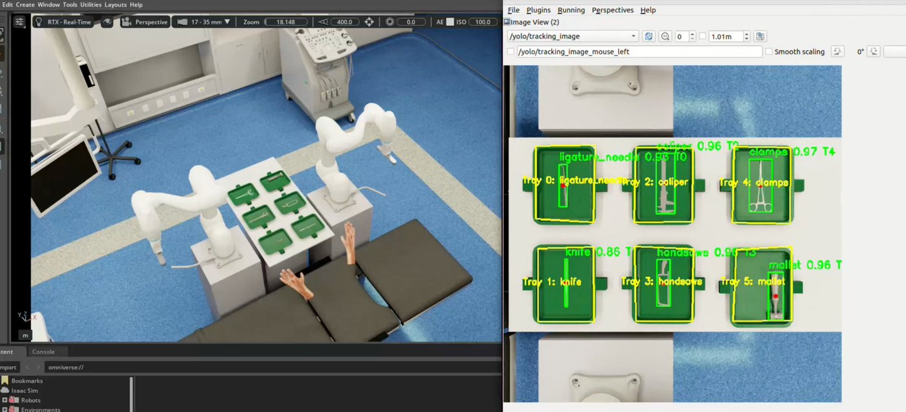
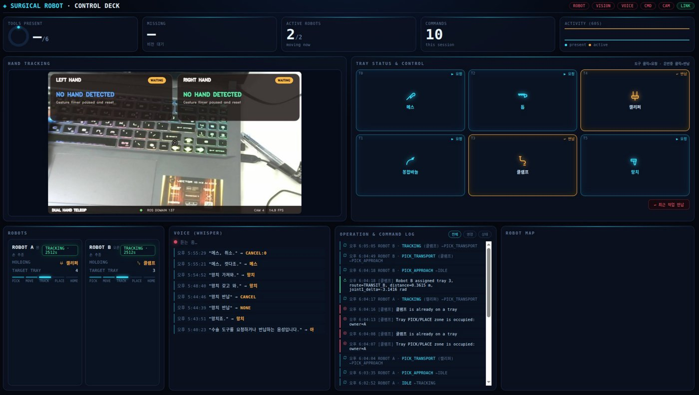
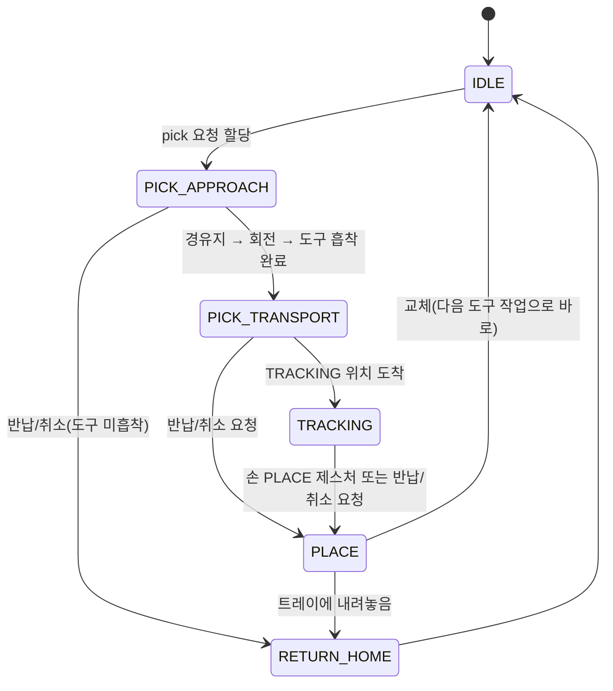

# Dual M0609 수술도구 전달 시뮬레이션 (Isaac Sim · ROS 2)

> 두산로보틱스 ROKEY 부트캠프 팀 프로젝트의 제출 스냅샷입니다. 공개하면서 README를 정리하고, clone만으로 씬을 복원할 수 있게 scene 자산을 분할해 올리고, 백업 URDF를 지웠습니다(개인 변경).

> ▶️ **[1분 시연 영상](https://youtu.be/EUDn9btPNTw)** — 이 프로젝트를 가장 빨리 파악할 수 있는 자료입니다. 참고 문서는 [더 읽을 문서](#더-읽을-문서)에 있습니다.
>
> 📄 [발표 자료(PDF, 66쪽)](https://github.com/gwanhuiGIM/Rokey_cobot3/releases/download/presentation/cobot3_presentation.pdf) — 세부 기술 발표 자료

**Isaac Sim 5.1 시뮬레이션 전용** 프로젝트입니다. 가상 수술실에서 Doosan M0609 두 대가 수술도구 6종을 트레이에서 집어 집도의 손 위치로 가져다주고, 반납·교체·취소 요청도 처리합니다.
명령은 손 동작(MediaPipe), 음성(Whisper + Gemini), 웹 대시보드 클릭으로 냅니다. 트레이별 도구 유무는 YOLO가 시뮬레이터 카메라 영상에서 인식합니다.



> **핵심 설계**: 로봇 제어와 시뮬레이션은 Isaac Sim 프로세스 하나(`gripper_technique_test/main.py`)에 모았습니다. 손 추적·음성·비전·대시보드는 별도 프로세스로 띄우고 ROS 2 토픽(`ROS_DOMAIN_ID=137`)으로만 연결합니다. Isaac 번들 Python(3.11)과 시스템 Python(3.10)을 섞지 않으려고 코드상 이렇게 나눴습니다.

```
[웹캠] → handtracking_final/hand_trackerorigin.py ─ /left|right_hand_* ───────────┐
[마이크] → voicellm/voice_llm_model.py ─ /m0609/pick_command, return_tool, ───────┤
                                         return_recent                            ▼
[브라우저] ⇄ dashboard/dashboard_server.py ─ (같은 명령 토픽) ──→ gripper_technique_test/main.py (Isaac Sim)
     ▲                                                              OmniGraph ROS 2 Bridge(토픽 I/O)
     │                                                              robot_manager → 로봇 A/B 상태머신
     │                                                              cuRobo(TRACKING) · RMPFlow(pick/place)
     │                                                                    │ /rgb
     │                                                                    ▼
     └── /m0609/status, tool_command_result, tool_detection ── vision_detection_model/vision_tool_detection_node.py (YOLO)
```

## 환경 · 장비

- 필요한 환경:
  - Ubuntu 22.04, ROS 2 Humble(`RMW_IMPLEMENTATION=rmw_fastrtps_cpp`, `ROS_DOMAIN_ID=137`)
  - Isaac Sim 5.1(번들 Python 3.11)
  - 시스템 Python 3.10
- GPU: NVIDIA GPU가 필요합니다. 개발 PC는 RTX 5080(Blackwell, 드라이버 580)이었습니다. **이 GPU는 torch cu128 빌드가 필요합니다**(cu121 이하는 동작하지 않음).
- 장비: 웹캠 1대(손 추적)와 마이크 1개(음성). 로봇·그리퍼·도구 카메라는 모두 Isaac Sim 안의 가상 장비입니다.

## 저장소 구성

<details>
<summary>디렉터리 구성 · 저장소에 없는 것</summary>

```
gripper_technique_test/      Isaac Sim 메인: 씬·로봇 2대·상태머신·ROS 브리지 (run.sh로 실행)
  doosan-robot2/urdf/        M0609 URDF
  rmpflow/                   RMPFlow 설정·컨트롤러
  scene_operating.zip.part-* 수술실 씬 분할 압축(GitHub 100MB 제한 때문)
handtracking_final/          MediaPipe 손 추적 노드 + hand_landmarker.task
voicellm/                    Whisper + Gemini 음성 명령 노드
vision_detection_model/      YOLO 도구 인식 노드, best.pt, 트레이 ROI
dashboard/                   FastAPI 서버 + static/index.html
setup.sh · install_curobo.sh · requirements.txt   설치 스크립트와 pip 의존성 목록
```

저장소에 포함되지 않은 것:
- Isaac Sim 본체: 별도 설치가 필요합니다.
- cuRobo: `install_curobo.sh`가 받습니다.
- Gemini API 키: 환경변수 `GEMINI_API_KEY`로 넣습니다.

실행 경로는 `main.py`가 import하는 `gripper_technique_test/*.py`, `rmpflow/m0609_rmpflow_controller.py`, `rmpflow/m0609_pick_place_controller_surface.py`입니다. `hand_marker_visualizer.py`, `temp_dynamic_trays.py`, `rmpflow/m0609_pick_place_controller.py`는 실험·미사용 파일로, `main.py`가 import하지 않습니다.

</details>

## 무엇을 할 수 있나

| 사용자가 하는 일 | 시스템이 하는 일 |
|---|---|
| "메스 줘"라고 말하기(SPACE를 누르는 동안 녹음) | Whisper STT → Gemini(`gemini-2.5-flash`)가 도구 6종 중 하나로 분류 → `/m0609/pick_command` 발행 |
| "그거 아니야", "클램프 반납해" | 직전 요청 정정이면 `/m0609/return_recent`, 대상이 분명하면 `/m0609/return_tool` |
| 대시보드에서 트레이 클릭 | 같은 pick/return 토픽 발행, 결과(`/m0609/tool_command_result`)를 명령 로그로 표시 |
| 손바닥이 카메라를 향한 주먹 1.5초 유지(FOLLOW) / 손등이 카메라를 향한 편 손 1.5초 유지(PLACE) | 도구를 든 로봇이 TRACKING 상태에서 손을 따라가다가 PLACE 제스처에서 반납 시작 |
| Isaac 터미널에 `randomize` 입력 | 도구 4~6개를 무작위 트레이에 재배치(`tool_state_manager.py:205`). 요청 즉시가 아니라 코드가 안전하다고 판단한 시점에 적용 |



도구 6종: 메스 · 캘리퍼 · 클램프 · 망치 · 톱 · 봉합바늘 (`voicellm/voice_llm_model.py:39`).

## 시스템 구조





<details>
<summary>인식 · 판단 · 제어(상태머신) · 출력 세부</summary>

**인식**
- 손: `hand_trackerorigin.py`가 MediaPipe로 양손 위치·방향·제스처를 추적해 손 좌표와 모드(`FOLLOW`/`PLACE`/`WAITING`)를 발행합니다. 모드는 같은 제스처를 1.5초 유지해야 바뀝니다(`GESTURE_HOLD_SEC`, `:82`). 주먹+손바닥이 카메라 방향이면 FOLLOW, 편 손+손등이 카메라 방향이면 PLACE입니다(`:831-853`). 로봇 목표 위치는 손보다 20 cm 위입니다(`EE_Z_OFFSET = 0.20`, `:69`).
- 음성: `voice_llm_model.py`가 Whisper `small`로 받아 적고, Gemini로 요청과 반납 의도를 가릅니다.
- 비전: `vision_tool_detection_node.py`가 Isaac 카메라 영상(`/rgb`)에서 YOLO(`weights/best.pt`)로 도구를 검출하고, 트레이 ROI(`tray_rois.json`)별 결과를 `/m0609/tool_detection`(JSON)으로 발행합니다. 카메라나 트레이 배치가 바뀌면 `tray_roi_calibrator.py`로 ROI를 새로 잡습니다.

**판단**: `robot_manager.py`가 요청 도구가 있는 트레이를 찾아 로봇을 고릅니다.
- 1순위는 선호 로봇입니다. 짝수 트레이는 A, 홀수 트레이는 B입니다.
- 2순위는 트레이까지의 거리입니다(`robot_manager.py:256-268`).
- 작업을 받을 수 없는 로봇은 후보에서 뺍니다.
- 교체·특정 반납·최근 작업 반납·중복 요청 처리도 여기서 합니다.

**제어**: 로봇마다 `m0609_state_machine.py` 상태머신이 하나씩 돕니다.



- 도구 집기(흡착)는 `PICK_APPROACH` 안에서 끝납니다(`PickPhase.PICKING`, `m0609_state_machine.py:30-40`).
- 반납·취소 요청은 상태에 따라 다르게 처리됩니다(`request_cancel_and_return_from_manager`, `:412`). 도구를 아직 안 집었으면 바로 홈으로 가고, 들고 있으면 PLACE를 거칩니다.
- 그 밖의 상태에서는 요청을 거절하고 이유를 문자열로 돌려줍니다.
- 모션 플래너는 상태마다 다릅니다.
  - TRACKING: cuRobo 0.7.8(`m0609_tracking_controller.py` → `m0609_curobo_controller.py`)
  - pick/place: RMPFlow(`m0609_move_controller.py`, `rmpflow/m0609_pick_place_controller_surface.py`)
- 그리퍼는 Isaac surface gripper입니다(`dual_surface_gripper_adapter.py`).

**출력**: `m0609_ros_bridge.py`가 OmniGraph ROS 2 Bridge 노드를 만들어 토픽 입출력을 맡습니다. 대시보드(`dashboard_server.py`, FastAPI + WebSocket)는 다음 토픽을 받아 브라우저에 보여줍니다.
- `/m0609/status`, `/m0609/tool_detection`, `/m0609/tool_command_result`
- `/m0609/voice_log`, `/hand_tracking/image/compressed`

</details>

## 한계 · 미완성

- 시뮬레이션 전용입니다. 실물 M0609·그리퍼 구동 코드와 실물 도구 인식은 없고, 실물 환경을 준비하거나 모사하지도 않았습니다.
- Isaac Sim 본체·cuRobo·Gemini API 키는 저장소에 없어 따로 준비해야 합니다([저장소 구성](#저장소-구성)).
- 비-Isaac 모듈 4개는 pip판 `opencv-python`·`numpy`를 `--system-site-packages` venv에서 apt판 rclpy·cv_bridge와 함께 씁니다. 환경에 따라 버전이 충돌할 수 있습니다(아래 실행 절의 coverage/numba 문제가 그 사례).
- `ISAAC_SIM_PATH`를 지정하지 않으면 `setup.sh`·`run.sh`가 `$HOME` 아래를 `find`로 뒤집니다(`setup.sh:77`, `run.sh:23`). 직접 지정하는 편이 빠릅니다.

<details><summary>유지보수 메모</summary>

- 도구 6종의 이름 매핑은 코드 여러 곳(음성·대시보드·Isaac)에 따로 들어 있습니다. 한 곳을 바꾸면 나머지도 맞춰야 합니다.

</details>

## 더 읽을 문서

| 문서 | 내용 | 용도 |
|---|---|---|
| 이 README | 전체 흐름·설치·실행 | 먼저 읽기 |
| [gripper_technique_test/README.md](gripper_technique_test/README.md) | Isaac 메인의 상태·명령 세부 | 세부 참고(코드와 대조하지 않음) |
| [handtracking_final/README.md](handtracking_final/README.md) | 손 추적 환경변수·캘리브레이션 | 세부 참고 |
| [vision_detection_model/README.md](vision_detection_model/README.md) | YOLO·ROI 캘리브레이션 | 세부 참고 |
| [dashboard/README.md](dashboard/README.md) | 대시보드 실행·환경변수 | 세부 참고 |

## 설치

<details>
<summary>설치 절차 (setup.sh · 씬 복원)</summary>

```bash
git clone <this repo> && cd <repo>
./setup.sh
```

`setup.sh`가 하는 일:
- ROS·GPU·Isaac 경로 점검
- apt 패키지 설치
- 씬 조각을 합쳐 `gripper_technique_test/Collected_full_scene_operating/`로 복원
- 루트 `.venv` 생성(`--system-site-packages`) → torch cu128 먼저 설치 → `requirements.txt` 설치
- `install_curobo.sh`로 Isaac Python에 cuRobo v0.7.8 설치

씬을 손으로 복원할 때:
```bash
cd gripper_technique_test
cat scene_operating.zip.part-* > scene_operating.zip && unzip -q scene_operating.zip && rm scene_operating.zip
```

torch는 반드시 cu128을 먼저 설치합니다. 순서가 바뀌면 ultralytics·whisper가 CPU판 torch를 끌어와 cu128을 덮을 수 있습니다(`setup.sh:135` 주석).

</details>

## 실행

<details>
<summary>실행 절차 · 자주 겪는 문제</summary>

모든 터미널에서 먼저 실행할 것:
```bash
source /opt/ros/humble/setup.bash
export ROS_DOMAIN_ID=137 RMW_IMPLEMENTATION=rmw_fastrtps_cpp
```
2~5번 터미널에서는 추가로 `source <repo>/.venv/bin/activate`를 실행합니다. 1번(Isaac)은 venv가 필요 없습니다.

| # | 위치 | 명령 | 정상이면 |
|---|---|---|---|
| 1 | `gripper_technique_test/` | `./run.sh` | Isaac 창에 수술실 씬이 뜹니다. **Play(▶)를 눌러야** 브리지와 `/rgb`가 동작합니다. |
| 2 | `handtracking_final/` | `python3 hand_trackerorigin.py` | 카메라 창이 뜹니다. SPACE를 누르면 30 cm → 100 cm 거리 캘리브레이션이 시작됩니다. ESC/q로 종료합니다. |
| 3 | `vision_detection_model/` | `python3 vision_tool_detection_node.py` | `/m0609/tool_detection` 발행 |
| 4 | `voicellm/` | `GEMINI_API_KEY=... python3 voice_llm_model.py` | SPACE를 누르는 동안 녹음되고, 떼면 분류 결과가 나옵니다. |
| 5 | `dashboard/` | `python3 dashboard_server.py` | `http://localhost:8137` 접속 |

음성 없이 테스트하는 명령:
```bash
ros2 topic pub --once /m0609/pick_command std_msgs/msg/String "{data: '메스'}"   # 메스 요청
ros2 topic pub --once /m0609/return_recent std_msgs/msg/Empty "{}"              # 최근 작업 반납
ros2 topic echo /m0609/tool_command_result                                     # 수락/거절 결과
```

- 명령이 수락됐다고 해서 동작이 끝난 것은 아닙니다. 완료는 `/m0609/status` JSON의 `robots.<A|B>.state`가 `IDLE`로 돌아왔는지로 확인합니다(`robot_manager.py:1335`). 대시보드의 로봇 A/B 패널도 같은 값을 보여줍니다(`dashboard_server.py:133`).
- 종료: 실물 장비가 없으므로 정리할 하드웨어는 없습니다. 각 터미널을 Ctrl+C로 끄고, Isaac 창을 닫습니다.

자주 겪는 문제:
- 토픽이 안 보이면 모든 터미널의 `ROS_DOMAIN_ID=137`을 확인합니다.
- `/rgb`가 없으면 Isaac이 Play 상태인지 봅니다(`ros2 topic hz /rgb`).
- 웹캠이 안 열리면 `CAMERA_SOURCE=<번호>`를 지정합니다. 번호는 `v4l2-ctl --list-devices`로 찾습니다. 손 추적의 다른 환경변수는 [handtracking_final/README.md](handtracking_final/README.md)에 있습니다.
- voicellm이 바로 에러를 내면 `GEMINI_API_KEY`가 설정됐는지 봅니다.
- voicellm에서 `coverage`·`numba` 오류가 나면 원인은 venv가 시스템 패키지를 끌어온 것입니다. venv 안에서 `pip install --upgrade "coverage>=7.4" "numba>=0.59" "llvmlite>=0.42"`로 해결합니다.

</details>

## 검증

- 2026-09-23 기록(재실행하지 않음): fresh clone에서 `setup.sh`의 씬 복원 블록을 실행했고, 결과가 원본과 `diff -rq`로 같았습니다.
- 자동 테스트는 없고, 실기 성능 검증도 하지 않았습니다.
- `setup.sh` 전체 설치(apt·torch·cuRobo)와 5개 프로세스 동시 실행은 미검증입니다. 실행 표의 "정상이면" 열은 코드와 기존 문서를 근거로 적었습니다.

## License

이 저장소에는 License를 부여하지 않았습니다(All rights reserved). 포함된 upstream 코드와 자산(Doosan URDF, MediaPipe 모델, Isaac Sim 자산, cuRobo, Ultralytics 등)은 각 원본의 LICENSE를 따릅니다.
