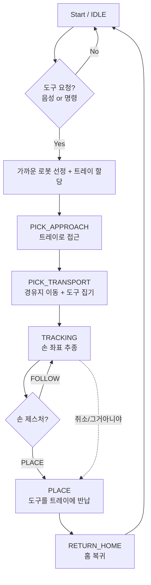

# 🤖 수술도구 텔레오퍼레이션 로봇 (Dual M0609 · Isaac Sim)

이 프로젝트는 **ROS 2 Humble** 과 **NVIDIA Isaac Sim 5.1** 환경에서 구동되는
**이중 협동로봇(Doosan M0609 ×2) 수술도구 전달 시스템**입니다.
집도의는 **손 동작(MediaPipe)** 과 **음성(Whisper + Gemini)** 으로 로봇을 조작하고,
**YOLOv8 비전** 이 트레이별 수술도구 상태를 실시간으로 인식하며,
**웹 대시보드** 로 전체 상태를 모니터링합니다.

> **도구 6종:** 메스 · 캘리퍼 · 클램프 · 망치 · 톱 · 봉합바늘

---

## 📌 주요 기능 (Key Features)

### 1. 손 동작 기반 텔레오퍼레이션 (Hand Teleoperation)
- **탐지:** 웹캠 + MediaPipe 로 양손의 위치·회전·제스처를 실시간 추적합니다.
- **제어:** 손 좌표를 로봇 EE 목표로 변환(손보다 **20cm 위**)하여 로봇이 손을 추종합니다.
- **모드 제스처:** `FOLLOW`(주먹+손바닥 카메라방향, 추종) / `PLACE`(편손+손등 카메라방향, 1회 반납) / `WAITING`(중립).

### 2. 음성 명령 (Voice Command)
- **탐지:** SPACE 녹음 → Whisper(small) STT → **Gemini** 가 도구 6종으로 분류합니다.
- **행동:** "메스 줘" → 가장 가까운 로봇이 해당 트레이로 이동해 집어 전달. "그거 아니야"/"반납" → 원위치 복귀.

### 3. 비전 도구 인식 (Tool Detection)
- **탐지:** Isaac `/rgb` → YOLOv8 로 트레이별 도구/빈칸을 인식합니다.
- **융합:** 트레이 empty + 로봇 보유 → "보유중", empty + 미보유 → **MISSING** 으로 판정.
- **시연:** 도구 **무작위 배치(randomize)** 로 비전 효과를 검증합니다.

### 4. 로봇 작업 관리 (Robot Task Management)
- 두 대 로봇에 작업 분배(트레이 0·2·4→A, 1·3·5→B 우선, 더 가까운 로봇이 처리).
- 도구 **교체 / 특정 반납 / 최근작업 반납 / PICK 도중 취소 / 중복요청 방지**.

### 5. 통합 웹 대시보드 (Web Dashboard)
- 손추적 영상(MJPEG) · 트레이 상태/클릭 명령 · 로봇 A/B 상태 · 음성 로그 · 명령 로그 ·
  KPI(present/missing/active/commands) · **Robot Map(궤적 애니메이션)** 을 실시간 표시.

---

## 🛠️ 시스템 설계 (System Architecture)

### 전체 구조
시스템은 크게 **Perception(인식)**, **Decision(판단)**, **Control(제어)** 세 파트로 구성됩니다.

1. **Perception:** MediaPipe(손) · YOLOv8(도구) · Whisper(음성) 가 센서 입력을 처리합니다.
2. **Decision:** Gemini 가 음성을 도구 명령으로 분류하고, 제스처 모드/상태기계가 로봇 동작을 결정합니다.
3. **Control:** Isaac Sim 의 OmniGraph ROS 2 Bridge 가 cuRobo/RMPFlow 모션 플래닝으로 로봇을 구동합니다.

### 데이터 흐름
```
[웹캠]  ── handtracking_final ──┐
                                ├─(ROS2, DOMAIN 137)─→ gripper_technique_test
[마이크] ── voicellm ───────────┤                       (Isaac Sim · 로봇/씬 · ROS Bridge
                                │                        · 상태기계 · cuRobo/RMPFlow)
[Isaac /rgb] ── vision_detection_model (YOLO) ──→ /m0609/tool_detection
                                │
        모든 상태 ──→ dashboard (FastAPI + WebSocket, http://localhost:8137)
```

### 알고리즘 플로우차트 (Logic Flow)


---

## 💻 개발 환경 (Environment)

- **OS:** Ubuntu 22.04 LTS (Jammy Jellyfish)
- **Middleware:** ROS 2 Humble Hawksbill (`RMW_IMPLEMENTATION=rmw_fastrtps_cpp`, `ROS_DOMAIN_ID=137`)
- **Simulator:** NVIDIA Isaac Sim 5.1
- **Language:** Python 3.10 (모듈 venv) / Python 3.11 (Isaac 번들 — gripper)
- **Key Libraries:** `rclpy`, `mediapipe`, `ultralytics`(YOLOv8), `openai-whisper`, `google-generativeai`, `cuRobo 0.7.8`, `fastapi`, `opencv-python`

> ⚠️ **torch 는 반드시 cu128.** RTX 5080(Blackwell) 은 cu121 이하 빌드에서 동작하지 않습니다.

---

## ⚙️ 사용 장비 (Hardware Setup)

<!-- TODO: PC 실제 스펙으로 채워주세요 (CPU/GPU/RAM) -->
- **PC:** CPU `_____` · GPU **NVIDIA RTX 5080** (드라이버 580) · RAM `_____`
- 본 프로젝트는 **Doosan M0609 협동로봇 2대(A/B)** 기준으로 개발되었습니다.

| Component | Type | Topic / Spec |
|-----------|------|--------------|
| Robot     | Doosan M0609 ×2 (6-DOF) | cuRobo / RMPFlow 모션 플래닝 |
| Hand Input| 웹캠 + MediaPipe Hands | `/left_hand_*`, `/right_hand_*` |
| Vision    | Isaac RGB 카메라 (Sim) | `/rgb` → `/m0609/tool_detection` |
| Voice     | 마이크 + Whisper(small) | `/m0609/pick_command`, `/m0609/voice_log` |

---

## 📦 의존성 설치 (Installation)

**전제:** ① Ubuntu 22.04 + NVIDIA GPU 드라이버, ② ROS 2 Humble, ③ Isaac Sim 5.1 **만** 미리 설치돼 있으면
나머지(cuRobo / mediapipe / whisper / torch / ultralytics …)는 스크립트가 전부 받습니다.

### A. 자동 설치 (권장)
```bash
git clone <REPO_URL> surgical_robot_main
cd surgical_robot_main
./setup.sh          # 사전조건 점검 + 모듈별 venv + 의존성 + cuRobo(v0.7.8) 자동 설치
```

### B. 수동 설치 (요약)
```bash
# 1) 시스템(apt) 패키지
sudo apt update
sudo apt install -y python3-venv python3-pip ros-humble-cv-bridge v4l-utils ffmpeg libportaudio2

# 2) venv (ROS 패키지가 보이게 --system-site-packages 필수)
source /opt/ros/humble/setup.bash
python3 -m venv --system-site-packages .venv && source .venv/bin/activate
python -m pip install --upgrade pip setuptools wheel

# 3) torch + torchvision 을 "먼저" cu128 로 (순서 중요)
pip install torch torchvision --index-url https://download.pytorch.org/whl/cu128
python -c "import torch; print(torch.__version__, torch.cuda.is_available())"   # ...+cu128 True

# 4) 나머지 pip 의존성
pip install -r requirements.txt

# 5) cuRobo (Isaac Python 에 v0.7.8)
./install_curobo.sh
```

- 상세 의존성 명세: [requirements.txt](requirements.txt)
- **Gemini API 키**(voicellm)는 코드/깃에 넣지 말고 **환경변수**로만 주입:
  ```bash
  export GEMINI_API_KEY="발급받은_키"
  ```

---

## 🗂️ 에셋 복원 (대용량 씬)

> **📦 제출 zip(.zip)으로 받은 경우 → 이 단계 건너뛰세요.**
> zip 안에는 씬 폴더(`Collected_full_scene_operating/`)가 **이미 압축 해제된 원본 그대로** 들어있어
> 별도 복원이 필요 없습니다. 바로 [의존성 설치](#-의존성-설치-installation)로 가면 됩니다.

**GitHub 에서 `git clone` 한 경우에만** 해당됩니다. 대용량 operating 씬(274MB)은
GitHub 100MB 제한 때문에 **압축·분할(`scene_operating.zip.part-*`)** 로 올렸으므로, 클론 후 복원이 필요합니다.

- **`./setup.sh` 를 돌리면 자동으로 복원됩니다** (별도 작업 불필요).
- setup.sh 없이 수동 복원하려면:
  ```bash
  cd gripper_technique_test
  cat scene_operating.zip.part-* > scene_operating.zip
  unzip -q scene_operating.zip && rm scene_operating.zip
  ls Collected_full_scene_operating/full_scene_backup.usda   # 확인
  ```

---

## 🚀 실행 순서 (How to Run)

> ### ⚠️ STEP 0 — 최초 1번만 (안 하면 아래 전부 실패!)
> ```bash
> cd ~/Desktop/surgical_robot_main      # ← 본인이 clone/압축푼 경로로 수정
> ./setup.sh                            # 루트 .venv 생성 + 의존성 설치 (몇 분, 한 번)
> ```
> 이걸 안 하면 `.venv` 가 없어서 아래 `source ../.venv/bin/activate` 가 **"그런 파일 없음"** 으로 전부 실패합니다.
>
> **아래 각 터미널 블록을 통째로 복붙**하세요. 맨 앞 `cd ...surgical_robot_main` 의 **경로만 본인 환경에 맞게** 바꾸면 됩니다.
> (터미널은 환경이 공유 안 되므로 블록마다 ROS 설정 + venv 활성화가 들어있습니다.)
> - `source ../.venv/bin/activate` 후 프롬프트가 **`(.venv)`** 로 바뀌면 정상.
> - **gripper(터미널 1)만 venv 불필요** — `run.sh` 가 Isaac `python.sh` + 도메인 설정까지 처리.

### 1. Isaac Sim — 로봇/씬 (터미널 1) · venv 불필요
```bash
cd ~/Desktop/surgical_robot_main/gripper_technique_test    # ← 본인 경로로 수정
./run.sh                 # Isaac python.sh 로 실행 (venv·도메인 자동)
```
- operating room 씬 로드 → 창이 열리면 **반드시 Play(▶)** 를 눌러야 ROS 2 Bridge / `/rgb` 동작.
- 터미널에 `randomize` 입력 → 도구 4~6개 무작위 배치(로봇 정지 상태일 때).

### 2. 손 추적 (터미널 2)
```bash
cd ~/Desktop/surgical_robot_main          # ← 본인이 clone/압축푼 경로로 수정
source /opt/ros/humble/setup.bash
export ROS_DOMAIN_ID=137 RMW_IMPLEMENTATION=rmw_fastrtps_cpp
cd handtracking_final && source ../.venv/bin/activate    # (.venv) 떠야 정상
python3 hand_trackerorigin.py             # 카메라 자동 탐색(CAMERA_SOURCE 기본 auto)
```
- SPACE 로 30cm → 100cm 거리 캘리브레이션 후 시작.

**참고 — 손추적 환경변수 (필요할 때만 앞에 붙여 실행)**

| 변수 | 기본값 | 설명 |
|------|--------|------|
| `CAMERA_SOURCE` | `auto` | 카메라 자동 탐색(0,1,2…). 고정하려면 번호 지정 (예: `CAMERA_SOURCE=4`). 번호는 `v4l2-ctl --list-devices` |
| `MIRROR_VIEW` | `1` | 좌우 반전(셀카 모드). 손 좌표가 반대로 움직이면 `MIRROR_VIEW=0` |
| `SWAP_HAND_LABELS` | `0` | 왼손/오른손 라벨이 바뀌어 보이면 `SWAP_HAND_LABELS=1` |
| `PUBLISH_IMAGE` | `1` | 대시보드용 영상 발행. 끄려면 `0` |
| `CAMERA_SCAN_MAX` | `6` | auto 탐색 시 훑을 최대 장치 번호 |

```bash
# 예: 특정 웹캠 고정 + 좌우반전 끄기 + 라벨 교환
CAMERA_SOURCE=4 MIRROR_VIEW=0 SWAP_HAND_LABELS=1 python3 hand_trackerorigin.py
```

**카메라 설정 자세히**

- **auto 동작:** `CAMERA_SOURCE=auto`(기본)면 `0,1,2 … CAMERA_SCAN_MAX(기본 6)` 순서로 열어보며
  **실제 프레임이 나오는 첫 장치**를 자동 선택합니다. 대부분 따로 지정할 필요 없습니다.
- **내 카메라 번호 찾기:**
  ```bash
  v4l2-ctl --list-devices     # 장치명 ↔ /dev/videoN 매핑
  ls -l /dev/video*           # 존재하는 카메라 노드
  ```
  여기서 나온 `/dev/videoN` 의 **N** 이 `CAMERA_SOURCE` 값입니다 (예: `/dev/video4` → `CAMERA_SOURCE=4`).
- **노트북 내장캠 대신 USB 웹캠을 쓰고 싶을 때:** auto 가 내장캠(보통 0)을 먼저 잡으므로,
  USB 캠 번호를 직접 지정하세요 (예: `CAMERA_SOURCE=4`).
- **자주 겪는 문제**
  - `Camera open failed` / 검은 화면 → 번호가 틀림. `v4l2-ctl --list-devices` 로 확인 후 지정.
  - 다른 프로그램(Zoom/브라우저/비전 노드)이 **카메라를 점유** 중이면 안 열립니다 → 닫고 재실행.
  - 권한 오류 → 사용자가 `video` 그룹에 있어야: `sudo usermod -aG video $USER` 후 재로그인.
  - 한 대 카메라를 **손추적·YOLO 비전이 동시에** 쓰지 못합니다. 비전은 Isaac `/rgb`(시뮬 카메라)를
    쓰므로 물리 웹캠과 충돌하지 않지만, 물리 웹캠을 두 노드가 같이 열면 충돌합니다.
  - 해상도/FPS 조정: `DISPLAY_WIDTH`/`DISPLAY_HEIGHT`(표시), `INFERENCE_WIDTH`(추론 입력) 환경변수.

### 3. YOLO 비전 (터미널 3)
```bash
cd ~/Desktop/surgical_robot_main          # ← 본인이 clone/압축푼 경로로 수정
source /opt/ros/humble/setup.bash
export ROS_DOMAIN_ID=137 RMW_IMPLEMENTATION=rmw_fastrtps_cpp
cd vision_detection_model && source ../.venv/bin/activate   # (.venv) 떠야 정상
python3 vision_tool_detection_node.py     # Isaac Play 상태 필요(/rgb)
```

### 4. 음성 명령 (터미널 4)
```bash
cd ~/Desktop/surgical_robot_main          # ← 본인이 clone/압축푼 경로로 수정
source /opt/ros/humble/setup.bash
export ROS_DOMAIN_ID=137 RMW_IMPLEMENTATION=rmw_fastrtps_cpp
export GEMINI_API_KEY="여기에_발급받은_키_붙여넣기"   # ★ 필수! 본인 Gemini API 키로 교체
cd voicellm && source ../.venv/bin/activate                # (.venv) 떠야 정상
python3 voice_llm_model.py
```
> **Gemini API 키 발급:** https://aistudio.google.com/app/apikey → "Create API key" → 생성된 키를 위 `GEMINI_API_KEY` 에 붙여넣기.
> 키는 **코드/깃에 넣지 말고 환경변수로만** 사용하세요. 매번 입력하기 싫으면 `~/.bashrc` 에 `export GEMINI_API_KEY="..."` 추가(단, 그 파일은 공유 금지).

### 5. 웹 대시보드 (선택)
```bash
cd ~/Desktop/surgical_robot_main          # ← 본인이 clone/압축푼 경로로 수정
source /opt/ros/humble/setup.bash
export ROS_DOMAIN_ID=137 RMW_IMPLEMENTATION=rmw_fastrtps_cpp
cd dashboard && source ../.venv/bin/activate               # (.venv) 떠야 정상
python3 dashboard_server.py               # http://localhost:8137
```

### CLI 직접 명령 (음성 없이 테스트)
```bash
ros2 topic pub --once /m0609/pick_command std_msgs/msg/String "{data: '메스'}"
ros2 topic pub --once /m0609/return_recent std_msgs/msg/Empty "{}"
ros2 topic echo /m0609/tool_command_result
```

---

## 📡 주요 ROS 2 토픽

| 토픽 | 타입 | 방향 |
|------|------|------|
| `/left_hand_*`, `/right_hand_*` | Point/String/Quaternion | handtracking → Isaac |
| `/m0609/pick_command`, `/m0609/return_tool` | String (도구명) | voice/CLI → Isaac |
| `/m0609/return_recent` | Empty | voice/CLI → Isaac |
| `/m0609/tool_command_result` | String(JSON) | Isaac → 외부 |
| `/m0609/status` | String(JSON) | Isaac → dashboard |
| `/rgb` | Image | Isaac → vision |
| `/m0609/tool_detection` | String(JSON) | vision → dashboard |
| `/hand_tracking/image/compressed` | CompressedImage | handtracking → dashboard |

---

## 🧯 트러블슈팅

- **토픽 안 보임** → 모든 터미널 `ROS_DOMAIN_ID=137` 동일 확인.
- **`/rgb` 없음** → Isaac 이 Play 상태인지 (`ros2 topic hz /rgb`).
- **웹캠 안 열림** → `CAMERA_SOURCE` 인덱스 확인(`v4l2-ctl --list-devices`).
- **voicellm 즉시 에러** → `GEMINI_API_KEY` 미설정.
- **voicellm 에서 `module 'coverage' has no attribute 'types'` / numba 오류** →
  `--system-site-packages` venv 가 시스템의 구버전 coverage/numba 를 끌어와 충돌하는 것.
  venv 활성화 후 최신으로 덮어쓰면 해결 (requirements.txt 에 이미 포함됨):
  ```bash
  source ~/Desktop/surgical_robot_main/.venv/bin/activate
  pip install --upgrade "coverage>=7.4" "numba>=0.59" "llvmlite>=0.42"
  ```
- **torch CPU판** → cu128 로 재설치(`pip install torch torchvision --index-url .../cu128`).

## 🔒 보안 메모
- API 키·비밀값은 **환경변수로만** 사용. 코드/깃 하드코딩 금지(`.gitignore` 차단 규칙 포함).
